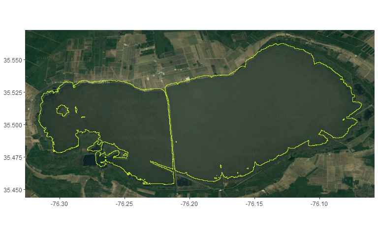
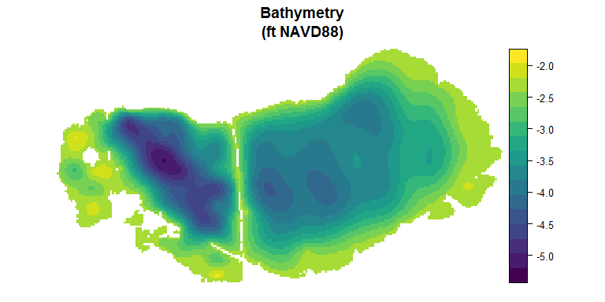
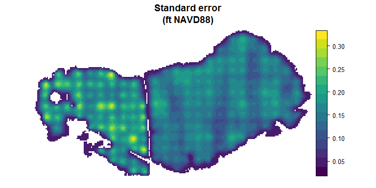

This document describes the generation of a bathymetry map/model for Lake Mattamuskeet.

The specific objectives of this document are:

1.  To extract the shoreline from [NAIP 2014 color infrared images](https://www.lib.ncsu.edu/gis/naip.html) collected on a known date (5 Oct 2014 in this case) so that the shoreline can be related to coincidental NADV88 lake level measurements (from USGS gages in Lake Mattamuskeet). The NAIP CIR image was resampled to 30 m resolution (from 1 m original) to improve computational efficiency. We derived the shoreline from NAIP using Normalised Difference Water Index.

2.  To use the derived shoreline and measurements of water depth (standardized to NADV88) from more than 500 locations in Lake Mattamuskeet.

Extracting the lake boundary
----------------------------

We derive the shoreline of Lake Mattamuskeet from NAIP imagery collected on 5 October 2014. Coincidental lake level measurements were roughly +0.1 ft (west basin) and +0.2 (east basin; NADV88). Note that the figure below suggests a few discrepances, particularly along the north shore of the lake and around islands; these are only an artifact of the plotting process here.



Bathymetry
----------

First, it is necessary to load some utitily functions (`utils.R`), a function to compile and export the bathymetry data from two sources (i.e., the 2013-2015 SAV surveys and ancillary bathymetry collection in 2016; `create_bath_df.R`), and a function the step through the fitting of the soap-fill smoother models (`fit_LM_bath.R`).

``` r
# Create bathymetric data frame
source("./R/utils.R")
source("./R/create_bath_df.R")
source("./R/fit_LM_bath.R")
```

The final bathymetry data set can be created by calling `create_bath_df`:

``` r
bath <- create_bath_df()  
```

This data set is in turn passed to the function for fitting a generalized additive model using a soap-film smoother (which honors the lake boundaries) to each basin. Although not shown here, the function pauses for user interaction at several spots to allow investigation of the models and their fit/appropriateness. It also generates, by default, the output raster layer of bathymetry (on a 100 m grid) and the standard error of the fit. Units are ft NAVD88. Note that the `fit_LM_bath` function has *many* options to allow customization; these will be explained (eventually) in the documentation of the function.

``` r
# Here the seed is set to reproduce the analysis in the manuscript
# Not setting the seed will result in slight differences in model fit
# due to the placement of knots during the setup of the soap-film smoother
LM_bath <- fit_LM_bath(bath_data = bath, seed = 1050412280)

# Save the model output
save(LM_bath, file = "./Output/LM_bath_models.rda")
```

Once the adequacy of the models has been assessed, we can plot the final outcomes --- a bathymetry model and its associated standard error. Note that the standard error is probably an underestimate (i.e., they are overconfident in the fit) because there is uncertainty in the actual location of bathymetry measurements (e.g., GPS error) and the measurements themselves that are, at present, unaccounted for by the model.


